# **Psychological test**


<br>

[View the deployed app on Heroku](https://psychological-test-9b5971c1081a.herokuapp.com/)

[View the Google Sheets worksheet for the app here](https://docs.google.com/spreadsheets/d/1hX7cJoDRUog7TXDuHcymWQj5D4xJEn-X63nRIaiNijA/edit#gid=0)

<br>

## **CONTENTS**

* [User Experience (UX)](#user-experience-ux)
    * [Strategy](#strategy)
        * [Project Goals](#project-goals)
    * [Scope](#scope)
    * [Design](#design)
        * [Python Logic Flow Chart](#python-logic-flow-chart)
        * [Functionality and Features](#functionality-and-features)
        * [Database](#database)
        * [Error Handling](#error-handling)
        * [Typography](#typography)
        * [Imagery](#imagery)
* [Technologies Used](#technologies-used)
    * [Languages Used](#languages-used)
    * [Programs Used](#programs-used)
    * [Frameworks and Libraries used](#frameworks-and-libraries-used)
* [Deployment and Local Development](#deployment-and-local-development)
* [Testing](#testing)
    * [Automated Testing](#automated-testing)
    * [Manual Testing](#manual-testing)
* [Bugs](#bugs)
* [Credits](#credits)
    * [Code Used and Referenced](#code-used-and-referenced)
    * [Media](#media)


# **User Experience (UX)**

## **STRATEGY**
___

## **Project Goals**

<br>

1. Personality Assessment: Testing can be used to assess a person's personality characteristics, such as temperament, introversion/extroversion, neuroticism, and other psychological traits. This can help a person better understand themselves and their individual characteristics.

2. Career Guidance: Personality tests can help determine which professions or career paths may be suitable for a particular person. For example, some temperament types may be more suited to leadership roles, while others may be suited to creative tasks.

3. Stress and Emotion Management: Test results can help a person better understand their emotional reactions and stress management strategies. This can promote better psychological well-being.

4. Psychological consultation: Psychologists can use test results to more accurately diagnose and develop psychological assistance. The tests can help identify psychological problems and give an initial idea of what types of therapy may be effective.
  

## **SCOPE**
___

### **Features**

<br>

* Allow the user to enter their name so that test results can be saved for that user and those results can be viewed in the future.

* Provide the user with information about the purpose of testing, as well as the possibilities of using the information received

* Provide the user with instructions for performing the test

* Allow the user to select their preferred answer to questions provided

<br>

### **Future Implementations**

<br>

Functionality that is not in the scope of this project but may be added later to improve the user experience:

* Ability for users to create an account with a password
* Possibility for the user to send the results via the provided email

<br>

## **DESIGN**
___

<br>

## **Python Logic Flow Chart**

<br>

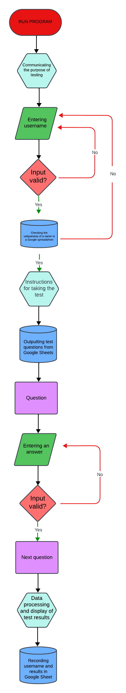

## **Functionality and Features**

<br>

### **Main Menu**

<br>

When launching the app, users see a large Greek letter psi "Ψ". The words psyche, psychology, psychiatry begin with this letter, and therefore this letter has become part of the logo of almost all psychological organizations in the world.
This letter was created using an ASCII image generator and asks the user to make a choice: take a psychological test, view the results of a previous test, or exit the program.

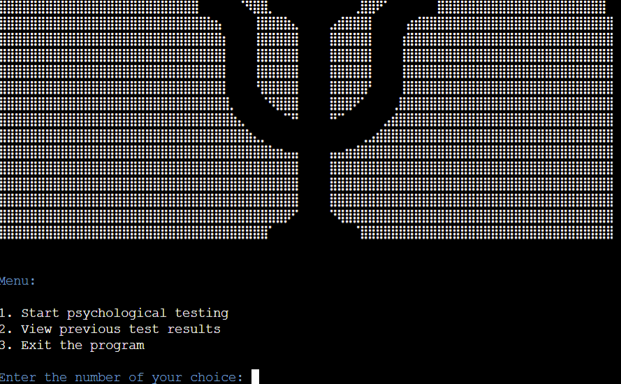


If the user chooses to take the test, a welcome message appears in front of him explaining the purpose of the test.

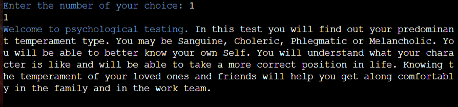

### **Instruction block**

<br>
Below the welcome message, the user is asked to enter their name:


To pass verification, the name entered must contain at least three characters and no more than 10 characters. If this verification test fails, the following message is displayed:

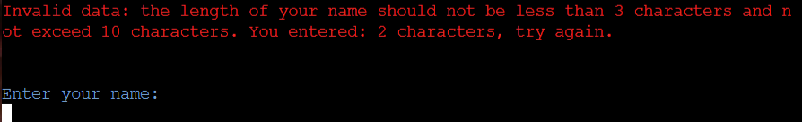

If the user enters numbers, he will also be shown a message that he can only enter letters

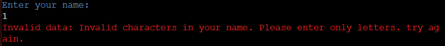

If the entered name is already in the Google spreadsheet, the application will prompt you to enter a new unique name:

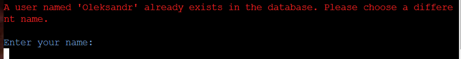

After specifying a valid name, the user will be shown instructions for taking a psychological test:

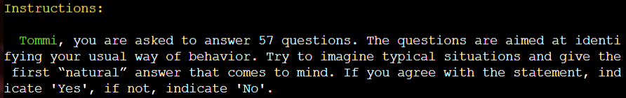

The next step is to show test questions where the user needs to answer “Yes” or “No”:


This is followed by checking the user's answer and if he answers other than "Y" or "N" then the following message appears:


After answering all questions, test results appear:

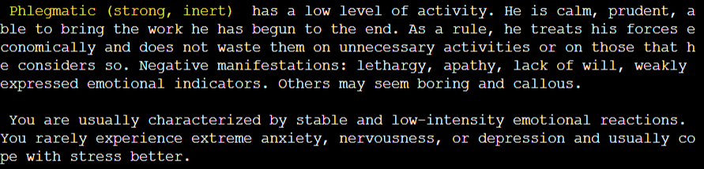

If the user was not honest enough when answering, then the psychological test will reveal this and the program will show about this message. In this case, the test results are considered invalid:

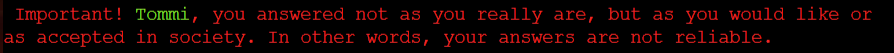

Also, when testing is completed, a message appears indicating that testing is completed:


Next, the user is prompted to take the test again or view the test results

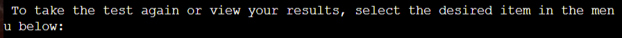

And the menu appears in front of the user again:


If the user wants to see the results of previous testing, he enters the number 2 and is prompted to enter his name. If the user has entered their name incorrectly, an error message will appear:

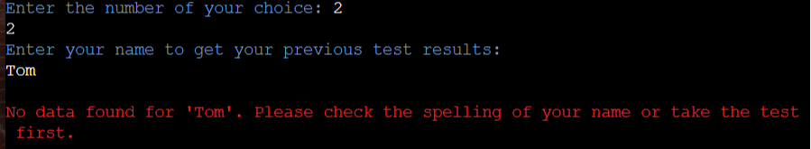
<br>

If the user entered his name correctly, the test results will appear:

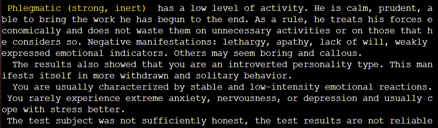

After the test results, a menu appears again where you can select “Exit the program” and the final message appears:

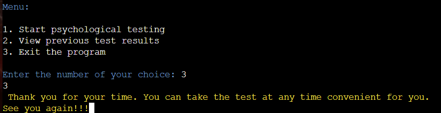


## **Database**

The data is stored in a Google Sheets document and the app accesses it through the Google Drive and Google Sheets APIs. The table can be viewed [here](https://docs.google.com/spreadsheets/d/1hX7cJoDRUog7TXDuHcymWQj5D4xJEn-X63nRIaiNijA/edit#gid=0).  The spreadsheet consists of the following sheets:

### **Questions**

<br>

All questions that participate in testing are stored here. If necessary, questions can be updated:

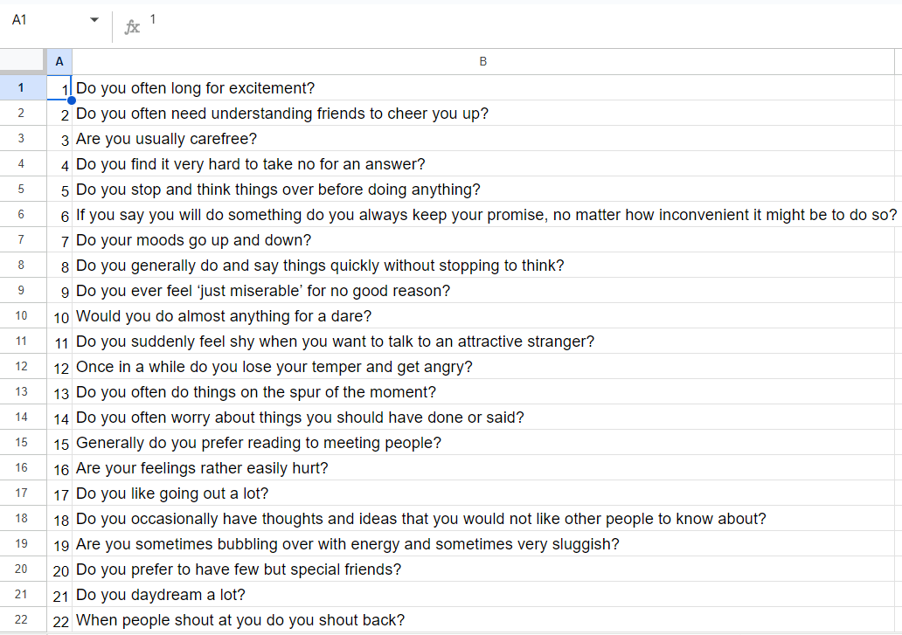


### **User Page**

<br>

When passing the test, a separate tab with the user name is formed in the Google spreadsheet, and all information about the test results is also recorded here. This new data tab is created for each new user:

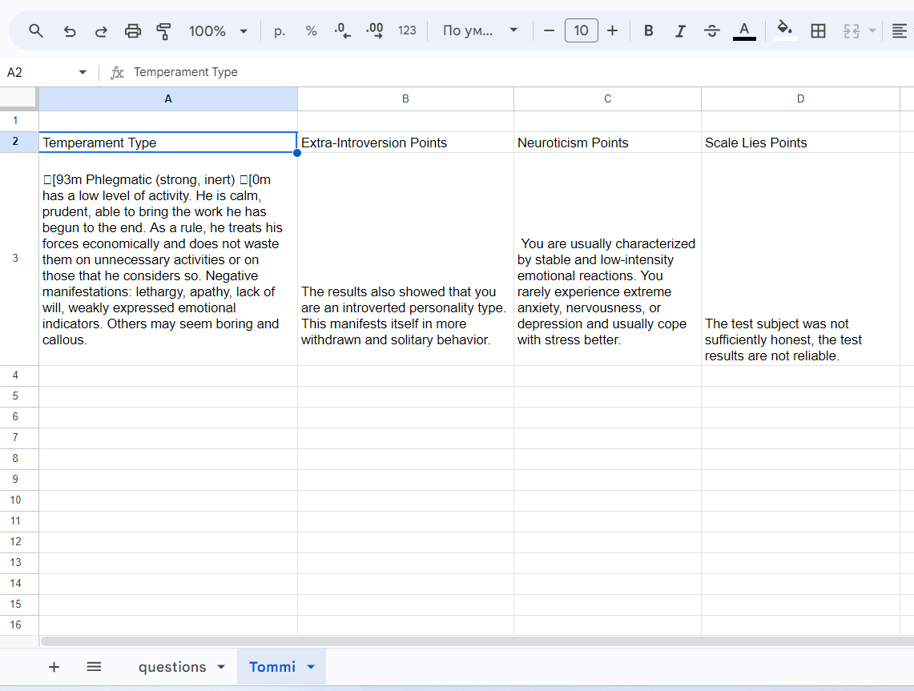


## **Error Handling**

<br>
As stated in the "Functionality and Features" section, all user input is validated and any errors are handled gracefully so the user is kept aware of the problem and feedback is provided to help the user correct their error


## **Typography**

<br>

Consistent color schemes were used throughout the application to provide an intuitive user experience and ensure key information was highlighted. Green text informs the user that a value is required, red text marks user input errors and provides the user with information on how they can enter a valid value. Key information is highlighted in blue.

<br>

## **Imagery**

This project is deployed on Heroku and uses the Code Institute template to run the application in a mock terminal. I made some changes to the default html and css files to personalize the application and also to help the user immediately understand the purpose of the site: 


The following background image has been added to the css class 'body' in the layout.html file:


I also added the following icon to the head element of the layout.html file:


<br>

# **Technologies Used**

## **Languages Used**

<br>

Python was used to create this project.

<br>

## **Programs Used**

<br>

* Git -  Version control.
* [GitHub](https://github.com/) - All files for the website stored and saved in a repository.
* Gitpod - IDE used to write the code.
* [LucidChart](https://www.lucidchart.com/pages/) -For creating a flow diagram
* [Heroku](https://dashboard.heroku.com/apps) - For deployment of the project.
* [PEP8](https://pep8ci.herokuapp.com/) CI Python Linter
* [Cloudconvert](https://cloudconvert.com/jpg-to-webp) - For compression of image files to improve website performance.
* [UiDev](https://ui.dev/amiresponsive) - For generating an image of the deployed app on devices 

<br>

## **Frameworks and Libraries used**

<br>

* [gspread](https://docs.gspread.org/en/latest/) - This is a Python API for Google Sheets and is used within the app to access and update data stored in various sheets across the master worksheet "psychological_test".

* [google.oauth2.service_account](https://google-auth.readthedocs.io/en/master/reference/google.oauth2.service_account.html) - From this module, the Credentials Class has been imported which then uses the creds.json file.


* [time](https://docs.python.org/3/library/time.html?highlight=time#module-time) - This module provides various time-related functions. For related functionality, see also the datetime and calendar modules

<br>

# **Deployment and Local Development**

<br>

## **Deployment to Heroku**

<br>

Before starting the deployment procedure, I created a list of requirements in gitpod, by entering the following command in the terminal:

```
pip3 freeze > requirements.txt
```

Heroku then uses this requirements.txt file to install the required dependencies.

The following steps were followed to deploy the app to Heroku:

1.  Create an account and login to [Heroku](https://id.heroku.com/login)
2.  In the Heroku dashboard, click the 'New' button at the top right of the screen and then select "Create new app".
3.  I selected the name 'psychological-test' ,set my region to Europe and clicked on the 'Create app' button.
4.  Click on the settings tab and then click the 'Reveal Config Vars' button.
5.  In the field for Key, enter CREDS (All capital letters).
6.  From my Gitpod workspace, I went to my creds.json file which has been listed in the .gitignore file, copied the entire contents of this file and pasted it in the config var value field.  Then click 'Add'.
7.  Add another config var, this time with the Key set to PORT and the value 8000.
8.  From the 'Buildpacks' section click on the 'Add buildpack' button.
9.  Select Python, then click 'save changes' button.
10.  Next add the node.js buildpack and click the 'save changes' button again.  **It is important that the buildpacks are added in this order.  If they have been added in the wrong order, they can be clicked and dragged so Python comes first and node.js is below it.**
11.  Next select the 'Deploy' tab, select GitHub as the deployment method, and click the 'Connect to GitHub' button.
12.  Search for the GitHub repository name in the 'App Connected to GitHub' section and then click the 'connect' button'
13.  You can now choose to enable automatic deploys or deploy manually.  When the 'automatic deploys' button is clicked and enabled, Heroku will rebuild the app every time a new change is pushed to GitHub.  In the 'Manual deploy' section, the 'Deploy branch' button can be clicked to deploy manually.
14. Once the app is built, a link is provided to the [deployed app](https://psychological-test-9b5971c1081a.herokuapp.com/).

<br>

## **Local Development**

<br>

### **How to fork:**

<br>

1. Log in (or sign up) to GitHub.
2. Find the required repository, in this case: https://github.com/CodeWizard-1/psychological-test
3. Click on the "fork" button at the top right of the page.

<br>

### **How to clone:**

<br>

1. Log in (or sign up) to GitHub.
2. Find the required repository, in this case: https://github.com/CodeWizard-1/psychological-test
3. Click on the green code button.  This will give you the choice of cloning the repository using HTTPS, an SSH key or GitHub CLI.  Make your selection and copy the provided URL link.
4. Open Terminal
5. Change the current working directory to the location where you want the cloned directory.
6. Type 'git clone' and then paste the URL you copied earlier.
7. Press enter.

<br>

# **Testing**

## **Automated Testing**

<br>

### **PEP8 Validation:**

<br>

I passed my run.py file through the [Code Institute Python Linter](https://pep8ci.herokuapp.com/) and no errors are found:

<br>

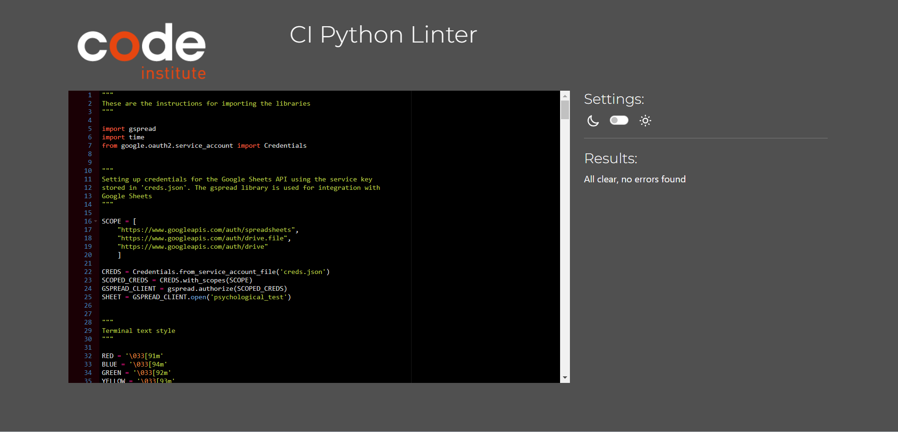

<br>


## **Manual Testing**

<br>

Follow this link to the [TESTING.md file](./TESTING.md) for documentation of the manual testing procedure I used for this project.
<br>

## **Bugs**

<br>

**1**
Issue: the user was able to enter numbers instead of letters when entering their name. This may lead to errors in user identification and other undesirable consequences.

<br>

Solution: the problem was successfully resolved using alphabetic character checks using isalpha() is a boolean function. This check has been implemented into the system during user name entry to ensure that the "Enter your name:" field contains only alphabetic characters. When the user tries to enter numbers or other characters, the system immediately detects the error and provides a description.

**2**

Issue:: If you answer a question incorrectly, an error message is displayed, but the question is not repeated.

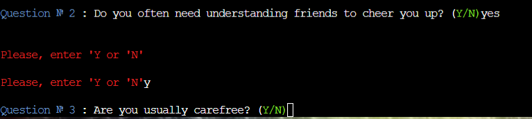
<br>

Solution: to solve this problem, the code included a loop that continues until the user receives the appropriate answer to the question. With this modification code, it is necessary to ask the same question until the user requires the appropriate answer (“Yes” or “No”). If the user gives an incorrect answer, they will see a message about Nurgals and will be asked to answer the question again.


# **Credits**

## **Code Used and Referenced**

<br>

* The code for setting up the Google Sheets API so that an application can add and manipulate data stored in a Google Sheets document was adapted from the Code Institute [Love Sandwiches](https://github.com/Code-Institute-Solutions/love-sandwiches-p5-sourcecode/tree/master).

* Was also inspired by the projects [American Pizza Project](https://github.com/useriasminna/american_pizza_order_system) and [The Coffee Run App](https://github.com/rkillickdev/the-coffee-run).

* Also, in preparing this project, a lot of useful information was obtained from this [reference book](https://www.w3schools.com/python/default).

<br>

## **Media**

<br>

* [Psychology symbol favicon taken from here](https://svgsilh.com/ru/image/2146164.html)
* [Background taken from here](https://oir.mobi/656128-psihologija-fon.html)

<br>