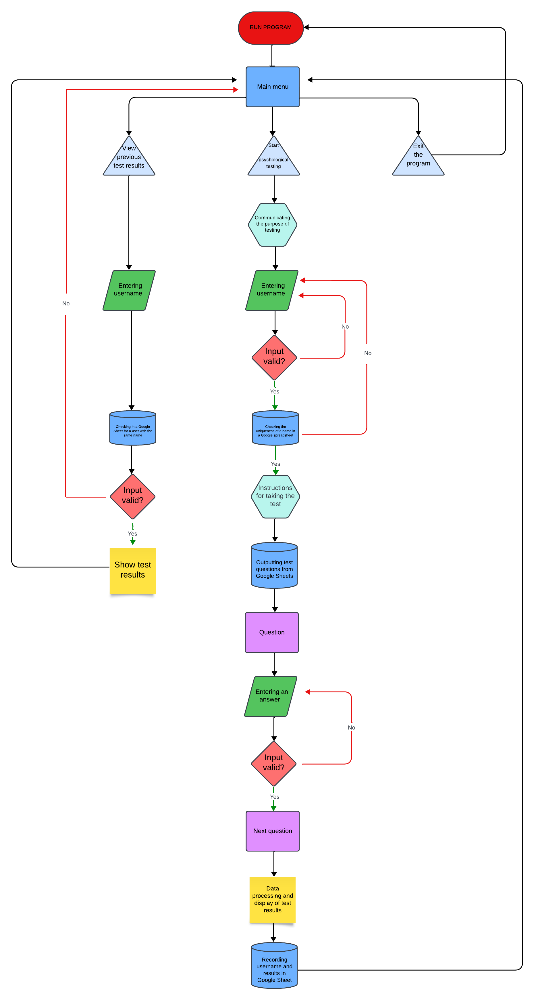

# **Psychological test**


<br>

[View the deployed app on Heroku](https://psychological-test-9b5971c1081a.herokuapp.com/)

[View the Google Sheets worksheet for the app here](https://docs.google.com/spreadsheets/d/1hX7cJoDRUog7TXDuHcymWQj5D4xJEn-X63nRIaiNijA/edit#gid=0)

<br>

## **CONTENTS**

* [User Experience (UX)](#user-experience-ux)
    * [Strategy](#strategy)
        * [Project Goals](#project-goals)
    * [Scope](#scope)
    * [Design](#design)
        * [Python Logic Flow Chart](#python-logic-flow-chart)
        * [Functionality and Features](#functionality-and-features)
        * [Database](#database)
        * [Error Handling](#error-handling)
        * [Typography](#typography)
        * [Imagery](#imagery)
* [Technologies Used](#technologies-used)
    * [Languages Used](#languages-used)
    * [Programs Used](#programs-used)
    * [Frameworks and Libraries used](#frameworks-and-libraries-used)
* [Deployment and Local Development](#deployment-and-local-development)
* [Testing](#testing)
    * [Automated Testing](#automated-testing)
    * [Manual Testing](#manual-testing)
* [Bugs](#bugs)
    * [Known Bugs](#known-bugs)
    * [Solved Bugs](#solved-bugs)
* [Credits](#credits)
    * [Code Used and Referenced](#code-used-and-referenced)
    * [Media](#media)
    * [Acknowledgements](#acknowledgements)


# **User Experience (UX)**

## **STRATEGY**
___

## **Project Goals**

<br>

1. Personality Assessment: Testing can be used to assess a person's personality characteristics, such as temperament, introversion/extroversion, neuroticism, and other psychological traits. This can help a person better understand themselves and their individual characteristics.

2. Career Guidance: Personality tests can help determine which professions or career paths may be suitable for a particular person. For example, some temperament types may be more suited to leadership roles, while others may be suited to creative tasks.

3. Stress and Emotion Management: Test results can help a person better understand their emotional reactions and stress management strategies. This can promote better psychological well-being.

4. Psychological consultation: Psychologists can use test results to more accurately diagnose and develop psychological assistance. The tests can help identify psychological problems and give an initial idea of what types of therapy may be effective.
  

## **SCOPE**
___

### **Features**

<br>

* Allow the user to enter username information so that test results can be saved for that user as well.

* Provide the user with information about the purpose of testing, as well as the possibilities of using the information received

* Provide the user with instructions for performing the test

* Allow the user to select their preferred answer to questions provided

<br>

### **Future Implementations**

<br>

Functionality that is not in the scope of this project but may be added later to improve the user experience:

* Ability for users to create an account in which they can store and see all test results
* Possibility for the user to send the results via the provided email

<br>

## **DESIGN**
___

<br>

## **Python Logic Flow Chart**

<br>



## **Functionality and Features**

<br>

### **Main Menu**

<br>

)

When starting the application, users see the large Greek letter psi "Ψ". The words psyche, psychology, psychiatry begin with this letter, and therefore this letter has become part of the logo of almost all psychological organizations in the world.
  This letter was created using an ASCII art generator and lets the user know that a psychological test will be taken.
A welcome message also appears in front of the user, informing about the purposes of testing, as well as the possibilities of applying the results obtained.

### **Instruction block**

<br>
Below the welcome message, the user is asked to enter their name:


To pass verification, the name entered must contain at least three characters, but more than 10 characters. If this verification test fails, the following message is displayed:


If the entered name is already in the Google spreadsheet, the application will prompt you to enter a new unique name:


After specifying a valid name, the user will be shown instructions for taking a psychological test:


The next step is to show test questions where the user needs to answer “Yes” or “No”:


This is followed by checking the user's answer and if he answers other than "Y" or "N" then the following message appears:


After answering all questions, test results appear:


If the user was not honest enough when answering, then the psychological test will reveal this and the program will show about this message. In this case, the test results are considered invalid:


Also, when testing is completed, a message appears indicating that testing is completed:


<br>

## **Database**

The data is stored in a Google Sheets document and the app accesses it through the Google Drive and Google Sheets APIs. The table can be viewed [here](https://docs.google.com/spreadsheets/d/1hX7cJoDRUog7TXDuHcymWQj5D4xJEn-X63nRIaiNijA/edit#gid=0).  The spreadsheet consists of the following sheets:

### **Questions**

<br>

All questions that participate in testing are stored here. If necessary, you can update them:


### **User Page**

<br>

When passing the test, a separate tab with the user name is formed in the Google spreadsheet, and all information about the test results is also recorded here. This new data tab is created for each new user:


## **Error Handling**

<br>
As stated in the [Functionality and Features](#functionality-and-features) section, all user input is validated and any errors are handled gracefully so the user is kept aware of the problem and feedback is provided to help the user correct their error


## **Typography**

<br>

Consistent color schemes were used throughout the application to provide an intuitive user experience and ensure key information was highlighted. Green text informs the user that a value is required, red text marks user input errors and provides the user with information on how they can enter a valid value. Key information is highlighted in blue.

<br>

## **Imagery**

This project is deployed on Heroku and uses the Code Institute template to run the application in a mock terminal. I made some changes to the default html and css files to personalize the application and also to help the user immediately understand the purpose of the site: 


The following background image has been added to the css class 'body' in the layout.html file:


I also added the following icon to the head element of the layout.html file:


<br>

# **Technologies Used**

## **Languages Used**

<br>

Python was used to create this project.

<br>

## **Programs Used**

<br>

* Git -  Version control.
* [GitHub](https://github.com/) - All files for the website stored and saved in a repository.
* Gitpod - IDE used to write the code.
* [LucidChart](https://www.lucidchart.com/pages/) -For creating a flow diagram
* [Heroku](https://dashboard.heroku.com/apps) - For deployment of the project.
* [PEP8](https://pep8ci.herokuapp.com/) CI Python Linter
* [Cloudconvert](https://cloudconvert.com/jpg-to-webp) - For compression of image files to improve website performance.
* [UiDev](https://ui.dev/amiresponsive) - For generating an image of the deployed app on devices 

<br>

## **Frameworks and Libraries used**

<br>

* [gspread](https://docs.gspread.org/en/latest/) - This is a Python API for Google Sheets and is used within the app to access and update data stored in various sheets across the master worksheet "psychological_test".

* [google.oauth2.service_account](https://google-auth.readthedocs.io/en/master/reference/google.oauth2.service_account.html) - From this module, the Credentials Class has been imported which then uses the creds.json file.


* [time](https://docs.python.org/3/library/time.html?highlight=time#module-time) - This module provides various time-related functions. For related functionality, see also the datetime and calendar modules

<br>

# **Deployment and Local Development**

<br>

## **Deployment to Heroku**

<br>

Before starting the deployment procedure, I created a list of requirements in gitpod, by entering the following command in the terminal:

```
pip3 freeze > requirements.txt
```

Heroku then uses this requirements.txt file to install the required dependencies.

The following steps were followed to deploy the app to Heroku:

1.  Create an account and login to [Heroku](https://id.heroku.com/login)
2.  In the Heroku dashboard, click the 'New' button at the top right of the screen and then select "Create new app".
3.  I selected the name 'psychological-test' ,set my region to Europe and clicked on the 'Create app' button.
4.  Click on the settings tab and then click the 'Reveal Config Vars' button.
5.  In the field for Key, enter CREDS (All capital letters).
6.  From my Gitpod workspace, I went to my creds.json file which has been listed in the .gitignore file, copied the entire contents of this file and pasted it in the config var value field.  Then click 'Add'.
7.  Add another config var, this time with the Key set to PORT and the value 8000.
8.  From the 'Buildpacks' section click on the 'Add buildpack' button.
9.  Select Python, then click 'save changes' button.
10.  Next add the node.js buildpack and click the 'save changes' button again.  **It is important that the buildpacks are added in this order.  If they have been added in the wrong order, they can be clicked and dragged so Python comes first and node.js is below it.**
11.  Next select the 'Deploy' tab, select GitHub as the deployment method, and click the 'Connect to GitHub' button.
12.  Search for the GitHub repository name in the 'App Connected to GitHub' section and then click the 'connect' button'
13.  You can now choose to enable automatic deploys or deploy manually.  When the 'automatic deploys' button is clicked and enabled, Heroku will rebuild the app every time a new change is pushed to GitHub.  In the 'Manual deploy' section, the 'Deploy branch' button can be clicked to deploy manually.
14. Once the app is built, a link is provided to the [deployed app](https://psychological-test-9b5971c1081a.herokuapp.com/).

<br>

## **Local Development**

<br>

### **How to fork:**

<br>

1. Log in (or sign up) to GitHub.
2. Find the required repository, in this case: https://github.com/CodeWizard-1/psychological-test
3. Click on the "fork" button at the top right of the page.

<br>

### **How to clone:**

<br>

1. Log in (or sign up) to GitHub.
2. Find the required repository, in this case: https://github.com/CodeWizard-1/psychological-test
3. Click on the green code button.  This will give you the choice of cloning the repository using HTTPS, an SSH key or GitHub CLI.  Make your selection and copy the provided URL link.
4. Open Terminal
5. Change the current working directory to the location where you want the cloned directory.
6. Type 'git clone' and then paste the URL you copied earlier.
7. Press enter.

<br>

# **Testing**

<br>

## **Automated Testing**

<br>

### **PEP8 Validation:**

<br>

I passed my run.py file through the [Code Institute Python Linter](https://pep8ci.herokuapp.com/) and no errors are found:

<br>


<br>

## **Manual Testing**

<br>

Please follow this link to the [TESTING.md file](https://github.com/rkillickdev/the-coffee-run/blob/main/TESTING.md), for documentation about the manual testing procedure I followed for this project.

<br>

## **Bugs**

<br>

### **Known Bugs:**

<br>

**1.**

I encountered a bug a couple of times while testing the deployed app, that I have not been able to reproduce consistently.  On quitting the app, a quantity input option was displayed:


I have since added the sys.exit() command at the end of the quit_app function and I have not experienced the bug since doing this.

<br>

### **Solved Bugs:**

<br>

**1.**  Deleting Items Keys Not Updated:

This was a problem when deleting an item from the order. Once an item had been removed, the item numbers shown in the table displaying the order, did not match up to the position of the dictionary in the list.  Therefore if an item was originally number 3 in the list, even when number 2 was deleted, the 2nd item would still be displayed as number 3, and if the user input this number it would throw an error.  I eventually worked out that I could not modify the key in the existing dictionaries, therefore I created new ones and updated user_order.items in the update_order_dict function with the following code:

```python
   for k, item in zip(keys, user_order.items):
        dict_key = list(item.keys())
        value = dict_key[0]
        new_dict = {k: item[value]}
        updated_order_list.append(new_dict)

    user_order.items = updated_order_list
```

**2.**  Order Details Displaying Incorrectly in Spreadsheet:


I had an issue where the quantity value displayed in the order details was incorrect.  I realised that it was actually using the value for unit_price which had been added to the item dictionary in the third position, but I had not subsequently updated the items_to_string function with the correct index. When I changed this to index 3 as seen below, the bug was solved:

```python
summary = f"{item[3]} X {item[0]} with {item[1]} milk"
```

**3.**  Quantity Error Handling:

During testing I realised that it was possible to enter the value zero as a quantity.  To fix this, I added the following line of code in the function validate_data:

```python
if user_input.isalpha() or int(user_input) < 1:
```

This means that user input will not be validated if they enter a character or a number that is less than 1.  Users are prevented from entering a quantity over 5 by the validate_drinks function.

**4.**  Main Menu Error Handling:

I noticed during testing that error handling for invalid codes in the main menu was not working as expected.  On investigation, I realised that the validate_function was attempting to compare integers against strings and throwing an error.  I solved this by converting the list of keys to validate against from a list of integers to a list of strings in the function input options:

```python
keys_as_strings = [str(x) for x in keys]
```

**5.**  Edit Quantities Exceeds Max drinks allowed:

I experienced a bug where if there was more than one item in the order and you tried to edit the quantity, it was possible to enter a number that would take the order drinks total over the maximum of 5 allowed.  I used the following code below to check whether user input + user_order.total_drinks exceeded the max allowed.  (Please note, when this snapshot was taken I was still allowing 10 drinks per order before eventually changing to 5 in the final version):

```python
elif step == "edit" and int(user_input) > 10 or int(user_input) + user_order.total_drinks > 10:
```

However, on further testing, I realised that the value for user_order.total_drinks was still taking into account the quantity for the item that the user was trying to edit.  As you can see in the image below, I should have been able to amend the flat white order from 8 to 3:


I therefore needed to set the quantity value to zero for the item being edited and then recalculate drinks total by calling get_drinks_total method on the user_order instance of Order.  When the updated quantity is entered by the user, the item being edited has a quantity value of zero rather than its existing quantity.  I achieved this by adding the following code in the input_options function:

```python
elif option == "edit":
item = user_order.items[index]
item[index + 1]['Quantity'] = 0
user_order.get_drinks_total()
updated_quantity = coffee_quantity("edit")
```

**6.**  Current Time 1 Hour behind London time:

As the coffee shop is based in London, I wanted to make sure that order times were based on the correct timezone.  To solve this, I imported the pytz module and passed in ‘Europe/London’ as an argument:

```python
now = datetime.now(pytz.timezone("Europe/London"))
```

**7.**  Duplicate Order Reference:

I realised during testing that if a user submitted an order and then returned to the main menu and created another order, on submitting this, the order reference was the same.  The solution to this was to update the attribute order_ref for the instance of Order (user_order) in the clear_order function.


**8.**  Order Summary Table Incorrect Column Order:

When printing the order summary to the terminal using tabulate, when only 1 item is present in the order, the price column displays before unit price therefore not adhering to the order they appear in the item dictionary (in the screenshot below I have printed the dictionary to the terminal to demonstrate this):


However, once a second item is added and the table is updated, the columns now appear in the correct order:


This bug was solved when I ended up renaming the columns.  For the 1st item, columns were being displayed in alphabetical order.  I actually wanted to label my columns differently and it happened that the new names fell in the correct alphabetical order, but a better solution should be investigated during future development.

**9.**  Pickup Status:

I noticed that if the order time was on one side of midnight and pickup time the other side, the order was  labelled as 'Ready'.  This is because current time is found to be greater than pickup time. I solved this by updating the variables present_datetime and pickup_datetime defined in the function view_completed.  I already had the following code in place to compare these two variables:

```python
if present_datetime < pickup_datetime:
                print(
                    f"Your coffee will be ready to pickup at"
                    f" {colored(order[7],'cyan',attrs=['bold'])}"
                    f" on {colored(order[8],'cyan',attrs=['bold'])}\n"
                )
```

But initially the variables present_datetime and pickup_datetime only stored the time.  When adding date, this functionality  began to work correctly.

In reality there would need to be time boundaries for when the app could be used or perhaps some code written to inform the user that if their order is placed after 6pm, pickup time is 7am the next day.  But for the purpose of this project, I wanted to make ordering available at any time of day so the full functionality of the app can be experienced without limitation.

**10.**  Prep Time Calculation 

During testing I realised that estimated prep time was not being calculated correctly, based on the number of recent orders.  I traced this to the get_recent function and realised when comparing the current and past, only time was being taken into account.  I therefore amended this function to also iterate over order date as shown in the code below:

```python
for order, date, time in zip(drinks, order_dates, order_times):
        max_time = timedelta(minutes=15)
        past_string = date + time
        past = datetime.strptime(past_string, "%d/%m/%Y%H:%M:%S")
        difference = current - past
```

Once fixed, you can see from the screen shot below that pickup times are now calculated correctly.  Order 191 is placed first with no other drinks placed in the past 15 minutes, so 5 drinks is estimated to take 10 minutes to prepare. Order 192 takes into account these other 5 drinks, adding 10 minutes of additional prep time so the total prep time for this 4 drink order is 18 minutes. Order 193 is for 1 drink but there are 9 other drinks placed in the past 15 minutes so prep time is calculated at 12 minutes.  And finally order 194 is only for 1 drink, but because there are 10 other drinks ordered in the past 15 minutes, an additional 15 minutes is added to the prep time which gives a total of 17 minutes.


**10.**  Existing Order Error

When attempting to view older existing orders, the following error was thrown:


I realised that the data stored in the "orders" sheet did not have a pickup time value for orders 1 - 50, as this feature had not been implemented when these orders were input.


To fix this, I entered pickup time values for these first 50 orders on the "orders" sheet, and as you can see below, details are now displayed correctly if you attempt to view any of these past orders:


<br>

# **Credits**

## **Code Used and Referenced**

<br>

* Code for setting up the Google Sheets API so the app could add and manipulate data stored in the google sheets doc, was adapted from the Code Institute [Love Sandwiches](https://github.com/Code-Institute-Solutions/love-sandwiches-p5-sourcecode/tree/master) walk through project.

* Initial Inspiration when planning the project and coming up with an idea, came from the [American Pizza Project](https://github.com/useriasminna/american_pizza_order_system) which was provided as an example project by Code Institute.

* [Clearing the screen in the terminal](https://code-institute-room.slack.com/archives/C027C3S3TEU/p1634300241255100?thread_ts=1634300071.255000&cid=C027C3S3TEU)

* [Using Tabulate in Python](https://www.askpython.com/python-modules/tabulate-tables-in-python)

* [Getting values from dictionaries in Python](https://www.codingem.com/python-dict-get-method-vs-square-brackets/)

* [Adding two lists to a dictionary in Python](https://pythonhow.com/how/convert-two-lists-into-a-dictionary/#:~:text=You%20can%20use%20the%20zip,values%20into%20a%20single%20iterable.)

* [Accessing Dictionary Keys](https://www.learnbyexample.org/python-nested-dictionary/#:~:text='%3A%20''%7D%7D-,Access%20Nested%20Dictionary%20Items,key%20in%20multiple%20square%20brackets.&text=If%20you%20refer%20to%20a,What%20is%20this%3F&text=To%20avoid%20such%20exception%2C%20you,special%20dictionary%20get()%20method)

* [Iterating over multiple lists](https://learnpython.com/blog/loop-over-multiple-lists/#:~:text=Using%20the%20zip%20Function%20to,more%20lists%20side%20by%20side.)

* [Checking if a string only contains letters](https://careerkarma.com/blog/python-isalpha-isnumeric-isalnum/#:~:text=isalnum()%20is%20a%20built,method%20returns%20the%20value%20False%20.)

* [Breaking up long lines of code](https://www.pythonmorsels.com/breaking-long-lines-code-python/)

* [Changing font colour in the terminal](https://towardsdatascience.com/prettify-your-terminal-text-with-termcolor-and-pyfiglet-880de83fda6b)

* [Using sum and zip to get sales totals function](https://sparkbyexamples.com/python/python-add-two-lists/?expand_article=1)

* [Getting past 10 days dates](https://www.pythonprogramming.in/getting-the-date-of-7-days-ago-from-current-date-in-python.html)

* [Converting a list of integers into a list of strings](https://blog.finxter.com/how-to-convert-an-integer-list-to-a-string-list-in-python/)

* [Learning how to use Datetime](https://www.freecodecamp.org/news/how-to-get-the-current-time-in-python-with-datetime/#:~:text=To%20get%20the%20current%20time%20in%20particular%2C%20you%20can%20use,hours%2C%20minutes%2C%20and%20seconds.)

* [Reference list of pytz timezones](https://gist.github.com/heyalexej/8bf688fd67d7199be4a1682b3eec7568)

* [Inspiration from Code Institute Home Library Project, for html updates to enhance visual aspect of app](https://github.com/alexkisielewicz/home-library-app)

<br>

## **Media**

<br>

* [Royalty free image used for the coffee cup favicon](https://uxwing.com/)

<br>

## **Acknowledgements**

<br>

* To my family for supporting me through this journey!
* To my Code Institute Mentor Can Sucullu for his help, advice and feedback during our mentoring sessions.