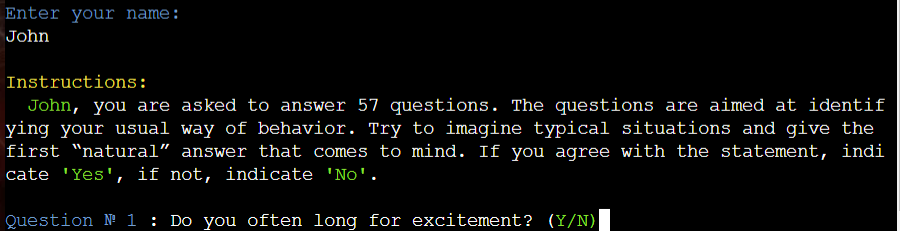

# **Testing**

 

## **Manual Testing**

### **Full Testing:**

 

The following steps were taken to test the functionality of the application's features and validate user inputs:

 

**Main Menu**

 

| Functionality Tested | Expected Outcome | Testing Performed | Pass/Fail |
| ------- | ---------------- | ----------------- | --------- |
|         |
| Load App | The main menu is displayed and the user is prompted to make a choice. | Click the "Run Program" button on the landing page of the deployed application. | Pass |

| Functionality Tested | Expected Outcome | Testing Performed | Pass/Fail |
| ------- | ---------------- | ----------------- | --------- |
|         |
| Validation for user input: **Enter the number of your choice:** | Error handled and feedback message displayed to user | Attempt input of "q" "empty" "4" | Pass |

| Functionality Tested | Expected Outcome | Testing Performed | Pass/Fail |
| ------- | ---------------- | ----------------- | --------- |
|         |
| Validation for user input: **Enter the number of your choice:** | Input validated  user input prompt for name displayed | Input "1" | Pass |

 

**User Name**

 

| Functionality Tested | Expected Outcome | Testing Performed | Pass/Fail |
| ------- | ---------------- | ----------------- | --------- |
|         |
| Validation for user input: **Enter you name:** | Error handled and feedback message displayed to user | Attempt input of "123" "!!!" "empty" | Pass |

| Functionality Tested | Expected Outcome | Testing Performed | Pass/Fail |
| ------- | ---------------- | ----------------- | --------- |
|         |
| Validation for user input: **Enter you name:** | Error handled and feedback message displayed to user | Attempt input of "w" "qwertyuiopas" | Pass |

| Functionality Tested | Expected Outcome | Testing Performed | Pass/Fail |
| ------- | ---------------- | ----------------- | --------- |
|         |
| Validation for user input: **Enter you name:** | If the name is entered correctly, the program continues its work and displays instructions for testing| Attempt input of "John" | Pass |

 

**Answers on questions**

 

| Functionality Tested | Expected Outcome | Testing Performed | Pass/Fail |
| ------- | ---------------- | ----------------- | --------- |
|         |
| Validation for user input: **(Y/N)** | Entering a Yes or No answer | Input of "T""empty"| Pass |

| Functionality Tested | Expected Outcome | Testing Performed | Pass/Fail |
| ------- | ---------------- | ----------------- | --------- |
|         |
| Validation for user input: **(Y/N)** | After entering the answer “Yes” or “No” to all questions, the test results appear. | Input of "Y" or "N"| Pass |

 

**View previous test results**

 

| Functionality Tested | Expected Outcome | Testing Performed | Pass/Fail |
| ------- | ---------------- | ----------------- | --------- |
|         |
| Validation for user input: **Enter your name to get your previos results:** | If such a name is not in the Google table, then the error is processed and a feedback message is displayed to the user. | Attempt input of "qwe" | Pass |

| Functionality Tested | Expected Outcome | Testing Performed | Pass/Fail |
| ------- | ---------------- | ----------------- | --------- |
|         |
| Validation for user input: **Enter your name to get your previos results:** | If such a name is in the Google table, then information with the results of its testing is displayed to the user. | Attempt input of "John" | Pass |

 

**Exit the program**

 

| Functionality Tested | Expected Outcome | Testing Performed | Pass/Fail |
| ------- | ---------------- | ----------------- | --------- |
|         |
| Validation for user input: **Exit the program** | With this choice, the program ends its work.| Attempt input of "3" | Pass |

